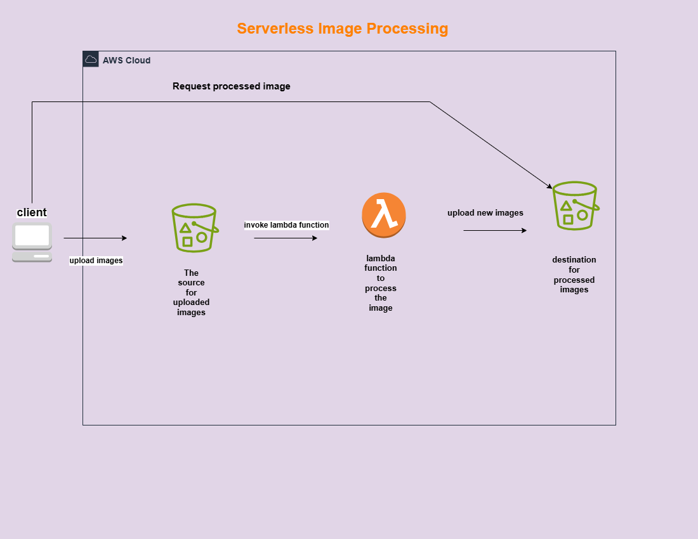

# Manara-SAA-Final-Project
This project implements a fully serverless image processing pipeline where users upload images that are automatically processed (resized, optimized, watermarked) using AWS Lambda functions triggered by S3 bucket events.
# Simple Serverless Image Processing on AWS

## Introduction

This repository illustrates a streamlined serverless architecture on Amazon Web Services (AWS) for handling image processing tasks. It demonstrates a fundamental workflow where uploaded images are automatically processed by a Lambda function and then stored in a designated location. This simplified approach highlights the core components of a serverless image pipeline.

## Project Goal

The primary objective of this project is to present a clear and concise serverless solution for basic image processing on AWS, focusing on efficiency and automation without the need for managing underlying servers.

## Key Components

This architecture utilizes the following essential AWS services:

1.  **Client:** Represents the user or application initiating the process by `upload images`.
2.  **The source to uploaded images (Amazon S3 Bucket):** An Amazon S3 bucket designated to receive and store the raw, original images uploaded by the client.
3.  **Lambda Function to Process the Image (AWS Lambda):** A serverless compute service that automatically `invoke lambda function` in response to new image uploads. This function contains the logic to perform the desired image processing (e.g., resizing, watermarking, format conversion).
4.  **Destination for processed images (Amazon S3 Bucket):** Another Amazon S3 bucket where the `upload new images` (processed images) are stored after the Lambda function has completed its work.

## Workflow

The image processing workflow in this architecture follows these steps:

1.  **Upload Images:** A `client` uploads images to `The source to uploaded images` S3 bucket.
2.  **Invoke Lambda Function:** The upload event to the source S3 bucket automatically `invoke lambda function` (AWS Lambda).
3.  **Process the Image:** The `lambda function to process the image` executes the defined image manipulation logic.
4.  **Upload New Images:** After successful processing, the Lambda function `upload new images` to the `destination for processed images` S3 bucket.
5.  **Request Processed Image (Optional):** The `client` can then `Request processed image` directly from the destination S3 bucket to retrieve the final processed output.

## Architecture Diagram

The following diagram provides a visual representation of this simple serverless image processing flow on AWS:

*(Please ensure the image filename `serverless-image-processing-simple-diagram.png` matches exactly what you upload to your repository.)*

## Features

* **Simplicity:** A straightforward design for core image processing.
* **Serverless:** Eliminates server management, reducing operational overhead.
* **Automation:** Automatic triggering of processing upon upload.
* **Scalability:** Leverages AWS services that scale automatically with demand.
* **Cost-Effective:** Pay-as-you-go model for Lambda and S3 storage.

## Conclusion

This architecture serves as a fundamental blueprint for building automated, serverless image processing capabilities on AWS, offering a clear path from image upload to processed storage.
